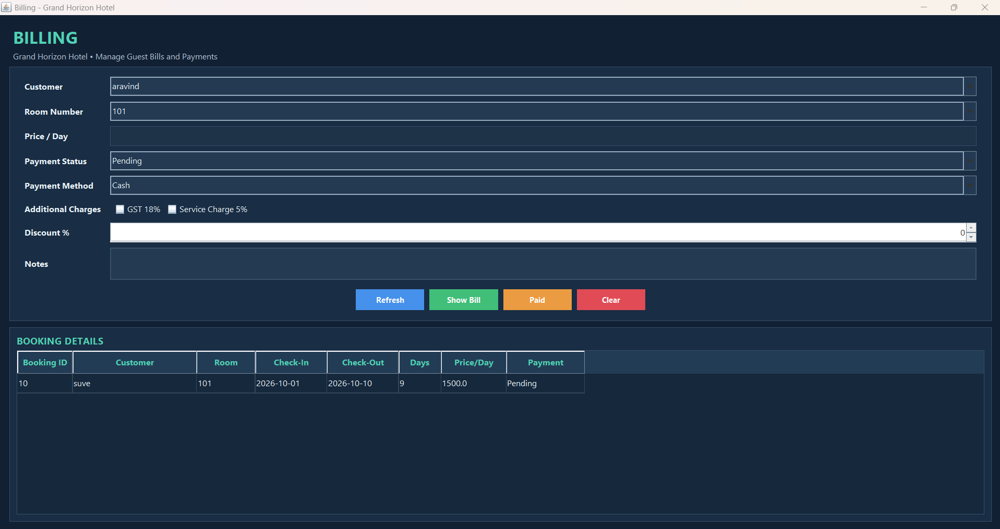

# 🏨 Hotel Room Management System

A desktop-based **Hotel Room Management System** developed using **Java Swing, JDBC, and MySQL**.

The application provides a graphical interface for managing hotel customers, rooms, bookings, billing, staff, and hotel food services. It uses JDBC to communicate with a MySQL database.

## 🚀 Features

* 👤 **Customer Management**

  * Add, update, delete, and search customer records

* 🛏️ **Room Management**

  * Manage room numbers, room types, prices, and room status
  * Supports AC and Non-AC rooms
  * Room status includes Available, Booked, and Maintenance
  * Dashboard displays room availability statistics

* 📅 **Booking Management**

  * Create and manage hotel bookings
  * Automatically changes room status to Booked
  * Checkout changes the room status back to Available

* 💳 **Billing**

  * Generate customer bills
  * GST calculation
  * Service charge
  * Discount
  * Final total
  * Payment status and Paid functionality

* 👨‍💼 **Staff Management**

  * Manage staff information
  * Staff ID, name, gender, role, phone, shift, salary, and status
  * Roles include Manager, Receptionist, Housekeeping, Security Guard, and Spa Therapist

* 🍽️ **Hotel Services**

  * Manage food/service orders
  * Breakfast, Lunch, and Dinner
  * South Indian, North Indian, and Foreign cuisine options
  * Room number and room ID based service

* 🔎 **Search Functionality**

  * Search records in different management modules

## 🛠️ Technologies Used

* **Java**
* **Java Swing** – Graphical User Interface
* **JDBC** – Database connectivity
* **MySQL** – Database
* **MySQL Connector/J**
* **VS Code** – Development environment
* **Git & GitHub** – Version control

## 🏗️ Application Architecture

```text
Java Swing GUI
      ↓
Java Application Logic
      ↓
JDBC
      ↓
MySQL Database
```

## 📁 Project Structure

```text
Hotel Room Management System
│
├── .gitignore
├── config.example.properties
├── hotel_db.sql
├── lib
│   └── MySQL Connector/J
│
└── src
    ├── Billing.java
    ├── Booking Management.java
    ├── Customer Management.java
    ├── Database Connection.java
    ├── Hotel Room Management.java
    ├── Hotel Service.java
    ├── Room Management.java
    └── Staff Management.java
```

## 🗄️ Database Setup

### 1. Install MySQL

Install MySQL Server on your computer.

### 2. Create the database

Open MySQL Command Line Client and run:

```sql
CREATE DATABASE hotel_db;
```

### 3. Import the database

The repository contains:

```text
hotel_db.sql
```

Import this SQL file into MySQL to create the required tables and data.

### 4. Configure the database connection

Create a file named:

```text
config.properties
```

in the main project folder.

Use:

```properties
url=jdbc:mysql://localhost:3306/hotel_db
username=root
password=YOUR_MYSQL_PASSWORD
```

Replace `YOUR_MYSQL_PASSWORD` with your own MySQL password.

> `config.properties` is intentionally excluded from GitHub using `.gitignore` so that database credentials are not exposed.

## ▶️ How to Run

1. Clone or download the repository.
2. Install Java JDK.
3. Install MySQL Server.
4. Import `hotel_db.sql` into MySQL.
5. Create your own `config.properties`.
6. Make sure the MySQL Connector/J `.jar` is available in the `lib` folder.
7. Open the project in a Java-supported IDE such as VS Code or IntelliJ IDEA.
8. Run:

```text
Hotel Room Management.java
```

This launches the main Hotel Room Management System window.

## 🔐 Security

Database credentials are **not stored directly in the Java source code**.

The application reads the database URL, username, and password from the local:

```text
config.properties
```

file.

The actual configuration file is excluded from Git using:

```text
config.properties
```

in `.gitignore`.

## 🎓 Project Purpose

This project was developed as an academic project to demonstrate practical implementation of:

* Object-Oriented Programming
* Java Swing GUI development
* JDBC connectivity
* MySQL database management
* CRUD operations
* Event-driven programming
* Database-driven desktop applications

## 👨‍💻 Author

**Priya Darshan E**

B.Tech Computer Science and Engineering (Data Science)

## 📌 Future Improvements

Possible future enhancements include:

* Total revenue dashboard
* Improved reporting and analytics
* Enhanced UI/UX
* Additional hotel services
* User authentication and role-based access
* Advanced booking and revenue reports

## 📸 Screenshots

### 🏨 Main Dashboard


### 🛏️ Room Management


### 👨‍💼 Staff Management


### 👤 Customer Management


### 📅 Booking Management


### 💳 Billing



### 🍽️ Hotel Services


